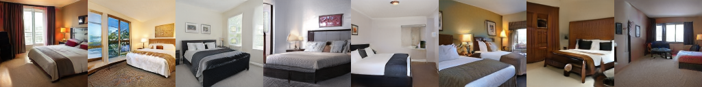
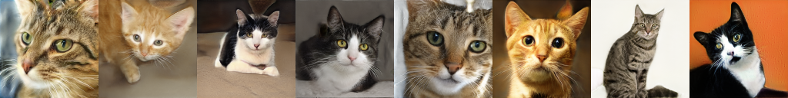
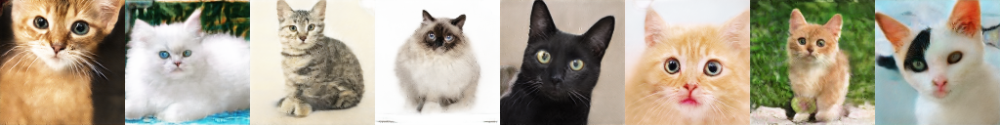
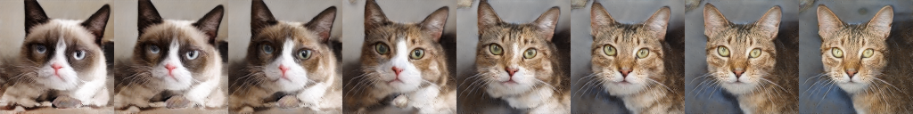

## LIA (LIA: Latently Invertible Autoencoder with Adversarial Learning)

## Requirements

 - Tensorflow (tested with v1.12.0)
 - Python3.6


## Training
### Decoder Training
Run

We just use an invertible network to replace the Mapping Network in StyleGAN, the remaining networks are all the same.


Run the training script with `python train_decoder.py` (For training details, 
please refer to [StyleGAN](https://github.com/NVlabs/stylegan). Here `train_decoder.py` is exactly the same script with StyleGan's `train.py` script.
We use a different name just to distinguish it from training script in the second stage of LIA).


### Encoder Training

Prepare for training Encoder

1. Add dataset's path to `data_train` and `data_test` in (`Data_dir`)
2. Add decoder's path to `decoder_pkl` (derived from the first-stage training) in (`Decoder_pkl`)

Run

`python train_encoder.py`


## Using pre-trained networks

All pre-trained networks are available on Google Drive, or one could produce them by the training script.
The weights are stored as Python PKL files, as StyleGAN does. The network weights contain 5 instances of 
[dnnlib.tflib.Network](./dnnlib/tflib/network.py), i.e. E, G, D, Gs, NE.

| Path | Description
| :--- | :----------
|[LIA.pdf](https://drive.google.com/open?id=1O4MCURPHKZpStlkA5Bvucclw6m4eqwcG) | paper PDF.
|[ffhq_128x128](https://drive.google.com/open?id=1H_H8GtJUbdM2PFapDZpnDRw7KPmU_lPh) | LIA trained with FFHQ dataset.
|[cat_128x128](https://drive.google.com/open?id=1dNF2WMKbQY73e4GNeMFtAs4o93p2Jqzw) |  LIA trained with LSUN Cat dataset.
|[bedroom_128x128](https://drive.google.com/open?id=1itqUH8VxOM74Ypcf8E26U1FtVB0qrDYP) | LIA trained with LSUN Bedroom dataset.
|[car_128x96](https://drive.google.com/open?id=1Jbb1yua4nphUREnq0mXNTNcRxYPBRWyf) | LIA trained with LSUN Car dataset.
|[boundaries](https://drive.google.com/open?id=1wB4l-nu1SdPEldLxxIJAZhkZSBPn5roZ) | Boundaries obtained by [InterFaceGAN](https://github.com/ShenYujun/InterFaceGAN) on FFHQ Dataset.


## Testing

1. Download the pre-trained network weights and the boundaries file.
2. Prepare the test data, such as `.png` images.

### Sampling

```
python test.py  --restore_path MODEL_PATH  --mode 0 --batch_size 16
```
||
|:---------:|
||
|sampling results on FFHQ|
||
|sampling results on LSUN bedroom|
||
|sampling results on LSUN cat|
||
|sampling results on LSUN car|

### Reconstruction

```
python test.py  --data_dir_test DATA_PATH  --restore_path MODEL_PATH  --mode 1 --batch_size 8
```
||
|:---------:|
||
||
|FFHQ|
||
||
|bedroom|
||
||
|cat|
||
||
|car|

For each group images, the first row shows the
original images and the second row shows the reconstructed images.

### Interpolation
```
python test.py  --data_dir_test DATA_PATH  --restore_path MODEL_PATH  --mode 3
```
||
|:---------:|
||
||
||
||


### Manipulation


```
python test.py  --data_dir_test DATA_PATH  --boundaries BOUNDARY_PATH --restore_path MODEL_PATH  --mode 4
```
||
|:---------:|
||
||
||

Each row shows the
original image, the reconstruction, glass, pose, gender, smile, and age.


##Reference

 [StyleGAN](https://github.com/NVlabs/stylegan)
 
 [ProGAN](https://github.com/tkarras/progressive_growing_of_gans)
 
 [Glow](https://github.com/openai/glow)