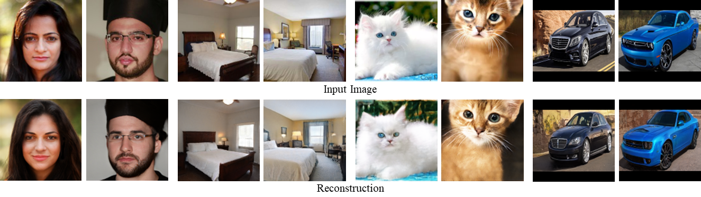

## LIA (Disentangled Inference for GANs with Latently Invertible Autoencoder)




**Figure:** *Image reconstruction using LIA on different datasets.*

In the repository, we verify that the disentanglement of the latent space is 
the decisive factor of learning a high-quality encoder for GAN. Based on 
the disentanglement argument, we develop a new model called Latently Invertible Autoencoder (LIA), 
which could invert an image into the latent spaces of W (disentanglement) and Z (entanglement) of stylegan, simultaneously. 


[[Paper](https://arxiv.org/abs/1906.08090)]


## Testing

### Pre-trained networks

All pre-trained networks are available on Google Drive, or one could produce them by the training script.
The weights are stored as Python PKL files, as StyleGAN does. The network weights contain 5 instances of 
[dnnlib.tflib.Network](./dnnlib/tflib/network.py), i.e. E, G, D, Gs, NE.

| Path | Description
| :--- | :----------
|[ffhq_128x128](https://drive.google.com/open?id=1H_H8GtJUbdM2PFapDZpnDRw7KPmU_lPh) | LIA trained with FFHQ dataset.
|[cat_128x128](https://drive.google.com/open?id=1dNF2WMKbQY73e4GNeMFtAs4o93p2Jqzw) |  LIA trained with LSUN Cat dataset.
|[bedroom_128x128](https://drive.google.com/open?id=1itqUH8VxOM74Ypcf8E26U1FtVB0qrDYP) | LIA trained with LSUN Bedroom dataset.
|[car_128x96](https://drive.google.com/open?id=1Jbb1yua4nphUREnq0mXNTNcRxYPBRWyf) | LIA trained with LSUN Car dataset.


1. Download the pre-trained network weights.
2. Prepare the test data, such as `.png` images.

### Sampling

```bash
MODEL_PATH='network-final-ffhq.pkl'
python synthesize.py  --restore_path $MODEL_PATH
```


### Reconstruction

```bash
MODEL_PATH='network-final-ffhq.pkl'
DATA_PATH='examples/ffhq'
python reconstruct.py  --restore_path $MODEL_PATH --data_dir_test $DATA_PATH 
```


### Interpolation

```bash
MODEL_PATH='network-final-ffhq.pkl'
DATA_PATH='examples/ffhq'
python interpolate.py  --restore_path $MODEL_PATH  --data_dir_test $DATA_PATH
```


### Manipulation

```bash
MODEL_PATH='network-final-ffhq.pkl'
DATA_PATH='examples/ffhq'
BOUNDARY_PATH = 'boundaries/happy_w_boundary.npy'
python manipulate.py  --restore_path $MODEL_PATH --data_dir_test $DATA_PATH --boundary $BOUNDARY_PATH
 ```


## Training
### Decoder Training
Run

We just use an invertible network to replace the Mapping Network in StyleGAN, the remaining networks are all the same.


Run the training script with `python train_decoder.py` (For training details, 
please refer to [StyleGAN](https://github.com/NVlabs/stylegan). Here `train_decoder.py` is exactly the same script with StyleGan's `train.py` script.
We use a different name just to distinguish it from training script in the second stage of LIA).


### Encoder Training

Prepare for training Encoder

1. Add dataset's path to `data_train` and `data_test` in (`Data_dir`).
2. Add decoder's path to `decoder_pkl` (derived from the first-stage training) in (`Decoder_pkl`).

Run

`python train_encoder.py`


## Citation
If you use this code for your research, please cite our paper:
```
@article{zhu2019lia,
  title   = {Disentangled Inference for GANs with Latently Invertible Autoencoder},
  author  = {Zhu, Jiapeng and Zhao, Deli and Zhang, Bo and Zhou, Bolei},
  journal = {arXiv preprint arXiv:1906.08090},
  year    = {2019}
}
```


## Reference

 [StyleGAN](https://github.com/NVlabs/stylegan)
 
 [ProGAN](https://github.com/tkarras/progressive_growing_of_gans)
 
 [Glow](https://github.com/openai/glow)